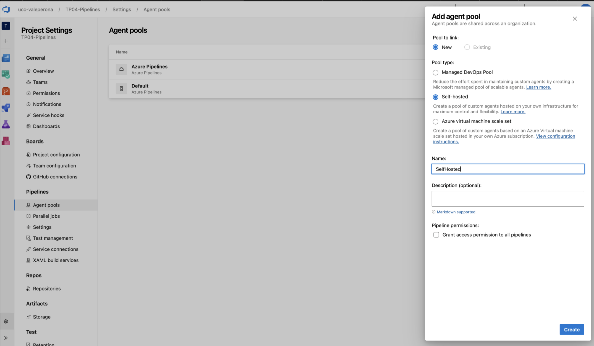
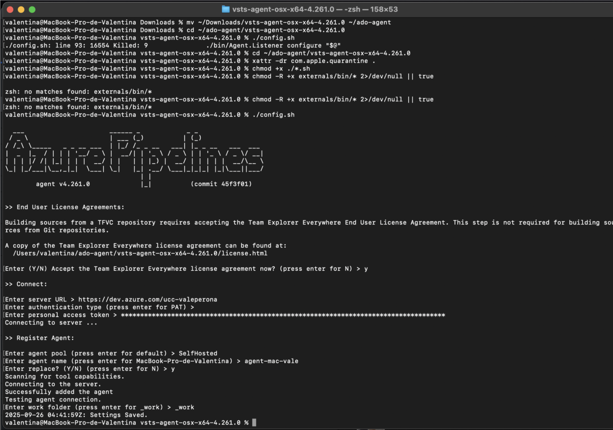
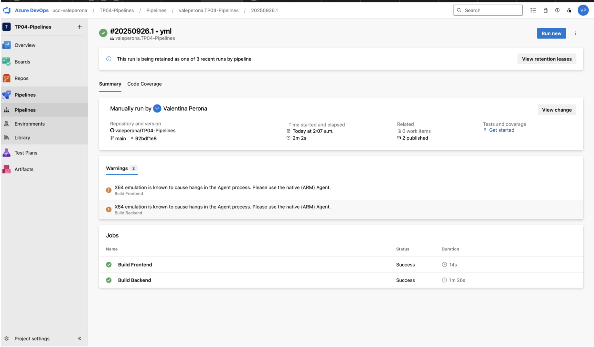
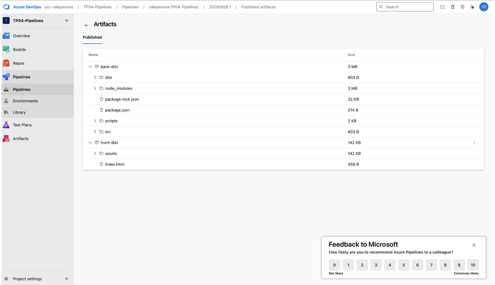

# TP04 – Azure DevOps Pipelines (2025) · Decisiones y Evidencias

## 1. Resumen
Implementé una CI en **Azure DevOps Pipelines** (YAML) para un **monorepo** con:
- **Frontend:** React + Vite (Node 20) → `front/dist`
- **Backend:** Express (Node 20) → `back/`
- **Agente:** Self-Hosted en mi Mac (`agent-mac-vale`)

---

## 2. Stack y estructura del repo
/
├─ front/ # React + Vite
│ ├─ src/
│ ├─ package.json
│ └─ dist/ # build del front
├─ back/ # Express (Node.js)
│ ├─ index.js
│ ├─ package.json
│ └─ dist/ (si compila)
└─ azure-pipelines.yml

**Decisión:** usar monorepo → un único repositorio versiona front + back y se construyen en paralelo.

---

## 3. Diseño del pipeline (YAML como código)

- **Por qué YAML y no Classic:**  
  Porque el pipeline queda versionado en Git, se puede auditar, compartir y modificar como código. Classic es solo clics en la UI, no reproducible.

- **Stage `CI`** → se ejecuta con cada commit en `main`.  

### Jobs
- **Build Frontend**
  - NodeTool@0 (Node 20)
  - `npm ci` en `/front`
  - `npm run build` → genera `front/dist`
  - `PublishBuildArtifacts` → artefacto `front-dist`

- **Build Backend**
  - NodeTool@0 (Node 20)
  - `npm ci` en `/back`
  - `npm run build` (opcional, si se compila)
  - `PublishBuildArtifacts` → artefacto `back-dist`

---

## 4. Self-Hosted Agent

- Creé un **pool** `SelfHosted`.
- Instalé el agente en mi Mac con `./config.sh`, `./svc.sh install` y `./svc.sh start`.
- Estado **Online** en ADO.  
- Ventaja: controlo versiones, entornos y dependencias.  
- Desventaja: la máquina debe estar encendida.

**Evidencia:**  

---

## 5. Ejecuciones de CI

Cada push a `main` dispara el pipeline.  
Se ve ejecución separada de `Build Frontend` y `Build Backend`, ambos exitosos.

**Evidencia:**  

---

## 6. Artefactos publicados

Los artefactos de cada job aparecen en la pestaña **Artifacts**:  
- `front-dist` (React/Vite)  
- `back-dist` (Express)

**Evidencia:**  

---

## 7. Justificación técnica

- **Self-Hosted vs Microsoft-Hosted:**  
  + Control total sobre Node, Docker, puertos, DB locales.  
  + Rapidez por cache local.  
  – Requiere mantenimiento.

- **Jobs separados:**  
  + Si falla uno, no bloquea todo.  
  + Permite paralelismo y claridad de logs.  
  + Artefactos independientes.

---

## 8. Mejoras futuras
- Instalar agente ARM nativo (sin emulación Rosetta).

---

## 9. Declaración de uso de IA
Usé IA (ChatGPT) para:  
- Redactar este documento y guiarme en la configuración del YAML.  
- Generar un proyecto monorepo para utilizar de base para el trabajo práctico.
Validé todo ejecutando el pipeline en Azure DevOps y revisando artefactos publicados.
